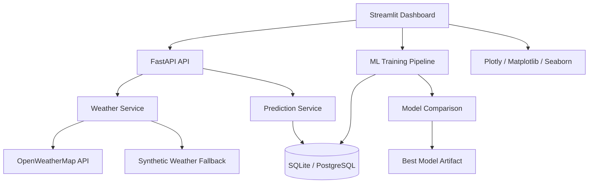

# AI-Based Air Pollution Prediction System

A production-style air quality analytics platform built with a FastAPI backend, a Streamlit SaaS dashboard, and a machine learning pipeline that compares Linear Regression, Random Forest, and XGBoost before automatically selecting the best model.

## What This Project Does

- Predicts AQI from live weather inputs and historical pollution data.
- Pulls current weather from OpenWeatherMap, with a synthetic fallback when an API key is missing.
- Trains multiple regression models and compares MAE, RMSE, and R².
- Persists predictions in SQLite by default, with PostgreSQL support through `DATABASE_URL`.
- Presents a modern dark analytics dashboard with gauges, trend charts, heatmaps, KPIs, export tools, and forecast views.
- Generates PDF reports and CSV exports.

## Architecture



## Project Structure

```text
AQI/
├── app.py
├── requirements.txt
├── README.md
├── .env.example
├── backend/
│   ├── api/
│   ├── core/
│   ├── db/
│   ├── ml/
│   ├── services/
│   └── utils/
├── frontend/
│   ├── components/
│   └── styles.py
├── data/
│   ├── raw/
│   └── processed/
└── artifacts/
```

## Environment Setup

1. Copy `.env.example` to `.env`.
2. Set `OPENWEATHER_API_KEY`.
3. Optionally set `DATABASE_URL` to PostgreSQL if you want a managed database.
4. Install dependencies:

```bash
pip install -r requirements.txt
```

## Run Locally

Start the API:

```bash
uvicorn backend.api.main:app --reload --host 0.0.0.0 --port 8000
```

Start the dashboard:

```bash
streamlit run app.py
```

## API Endpoints

- `GET /health` - service health check
- `POST /weather/current` - fetch live weather by city
- `POST /predict` - predict AQI from live or manually supplied weather values
- `POST /train` - retrain and compare models
- `GET /predictions/recent` - get recent stored predictions

Example prediction request:

```bash
curl -X POST http://127.0.0.1:8000/predict ^
  -H "Content-Type: application/json" ^
  -d "{\"city\":\"Delhi\"}"
```

## Phase-by-Phase Build Notes

### Phase 1: Project Setup
- Explanation: The repository is organized into reusable backend, ML, and frontend layers.
- Code: `backend/core/config.py`, `requirements.txt`, `app.py`
- Best practice: Keep configuration in environment variables.
- Common mistake: Hardcoding API keys or database URLs.
- Testing: Run `pip install -r requirements.txt` and launch both the API and dashboard.

### Phase 2: Dataset Collection and Preprocessing
- Explanation: The project reads a real AQI CSV from `data/raw/aqi.csv` and normalizes common schema variants into a model-ready frame.
- Code: `backend/utils/sample_data.py`, `backend/ml/preprocessing.py`
- Best practice: Preserve timestamps, city, weather, and pollutant columns during feature engineering.
- Common mistake: Training on a weather-only schema when pollutant measurements are available.
- Testing: Place your dataset in `data/raw/aqi.csv` and confirm the loader returns a normalized frame with `aqi`.

### Phase 3: Exploratory Data Analysis
- Explanation: The dashboard uses historical trends, pollutant summaries, a correlation heatmap, and AQI category distribution.
- Code: `backend/utils/plotting.py`, `frontend/components/charts.py`
- Best practice: Compare numeric features against AQI and inspect correlation before model selection.
- Common mistake: Using only one chart type and missing feature relationships.
- Testing: Open the dashboard and verify all charts render.

### Phase 4: Machine Learning Model Training
- Explanation: The training pipeline compares Linear Regression, Random Forest, and XGBoost when available.
- Code: `backend/ml/evaluate.py`, `backend/ml/train.py`
- Best practice: Keep the preprocessing pipeline inside the model artifact.
- Common mistake: Fitting preprocessing separately and leaking test data.
- Testing: Call `POST /train` and inspect the returned leaderboard.

### Phase 5: Evaluation and Comparison
- Explanation: The best model is selected using RMSE first, then MAE as a tie-breaker.
- Code: `backend/ml/evaluate.py`
- Best practice: Track all three metrics, not just one.
- Common mistake: Selecting the model only by training score.
- Testing: Review `artifacts/model_metrics.json` after training.

### Phase 6: Weather API Integration
- Explanation: Live weather is pulled from OpenWeatherMap and automatically falls back to synthetic values if needed.
- Code: `backend/services/weather.py`
- Best practice: Keep the API key in `.env` and never expose it in the UI.
- Common mistake: Binding the app to a live API without a fallback path.
- Testing: Remove the API key and confirm the dashboard still works.

### Phase 7: Dashboard Frontend
- Explanation: The Streamlit interface is styled as a dark SaaS dashboard instead of a student project.
- Code: `frontend/styles.py`, `frontend/components/*`, `app.py`
- Best practice: Use reusable components for metrics, alerts, charts, and navigation.
- Common mistake: Cramming all UI logic into one script.
- Testing: Navigate through Overview, Forecast, Data Lab, and Model Lab.

### Phase 8: Real-Time Prediction System
- Explanation: The dashboard fetches live weather, runs inference, and records the result.
- Code: `backend/services/prediction_service.py`, `app.py`, `backend/api/main.py`
- Best practice: Deduplicate writes so repeated refreshes do not flood the database.
- Common mistake: Saving the same prediction repeatedly on every rerun.
- Testing: Refresh the dashboard and verify new records appear only when the weather snapshot changes.

### Phase 9: Database Integration
- Explanation: Prediction history is stored in SQLite by default with an easy PostgreSQL upgrade path.
- Code: `backend/db/models.py`, `backend/db/session.py`
- Best practice: Store timestamps, source weather context, model name, and health label.
- Common mistake: Saving only the AQI number and losing auditability.
- Testing: Open `data/aqi.db` after running the app and inspect the `aqi_predictions` table.

### Phase 10: Deployment
- Explanation: The app can be deployed to Streamlit Cloud, Render, or Railway.
- Code: `requirements.txt`, `app.py`, `backend/api/main.py`
- Best practice: Set environment variables in the hosting platform and keep artifacts writable.
- Common mistake: Deploying without persistent storage for the database or model artifacts.
- Testing: After deployment, open `/health` on the API and verify the Streamlit dashboard loads.

## Deployment Guide

### Streamlit Cloud
1. Push the repository to GitHub.
2. Set the Streamlit app entrypoint to `app.py`.
3. Add environment variables in the Streamlit Cloud settings.
4. If you want persistent model artifacts, connect storage or use a managed database for records.
5. Deploy and verify the dashboard loads.

### Render
1. Create a new Web Service for the FastAPI backend with `uvicorn backend.api.main:app --host 0.0.0.0 --port $PORT`.
2. Create a second service for Streamlit with `streamlit run app.py --server.port $PORT --server.address 0.0.0.0`.
3. Add the same environment variables to both services.
4. Set `DATABASE_URL` to PostgreSQL for persistence.
5. Redeploy after checking the logs.

### Railway
1. Create a new project and connect the repository.
2. Add the environment variables from `.env.example`.
3. Deploy the API service with Uvicorn and the dashboard service with Streamlit.
4. Use Railway PostgreSQL if you want managed persistence.
5. Confirm that `/health` returns `ok` and the dashboard can save predictions.

## Testing Instructions

### Quick Smoke Test
```bash
python -m compileall backend app.py
```

### API Smoke Test
```bash
uvicorn backend.api.main:app --reload
```
Then open:
- `http://127.0.0.1:8000/health`
- `http://127.0.0.1:8000/docs`

### Dashboard Smoke Test
```bash
streamlit run app.py
```
Verify:
- city search works
- AQI gauge renders
- forecast chart renders
- PDF and CSV downloads work
- map visualization appears in Data Lab

### Model Test
1. Put your AQI dataset in `data/raw/aqi.csv`.
2. Trigger `POST /train`.
3. Confirm the best model name and metrics are returned.
4. Check that `artifacts/best_model.joblib` and `artifacts/model_metrics.json` are created.

## Notes

- The project expects a real AQI CSV at `data/raw/aqi.csv`.
- If your dataset uses alternate column names, the loader maps common aliases like `pm2.5`, `temp`, `location`, and `date`.
- XGBoost is optional; if it is unavailable, the pipeline still compares Linear Regression and Random Forest.
- The dashboard is intentionally dark, restrained, and operational rather than decorative.
